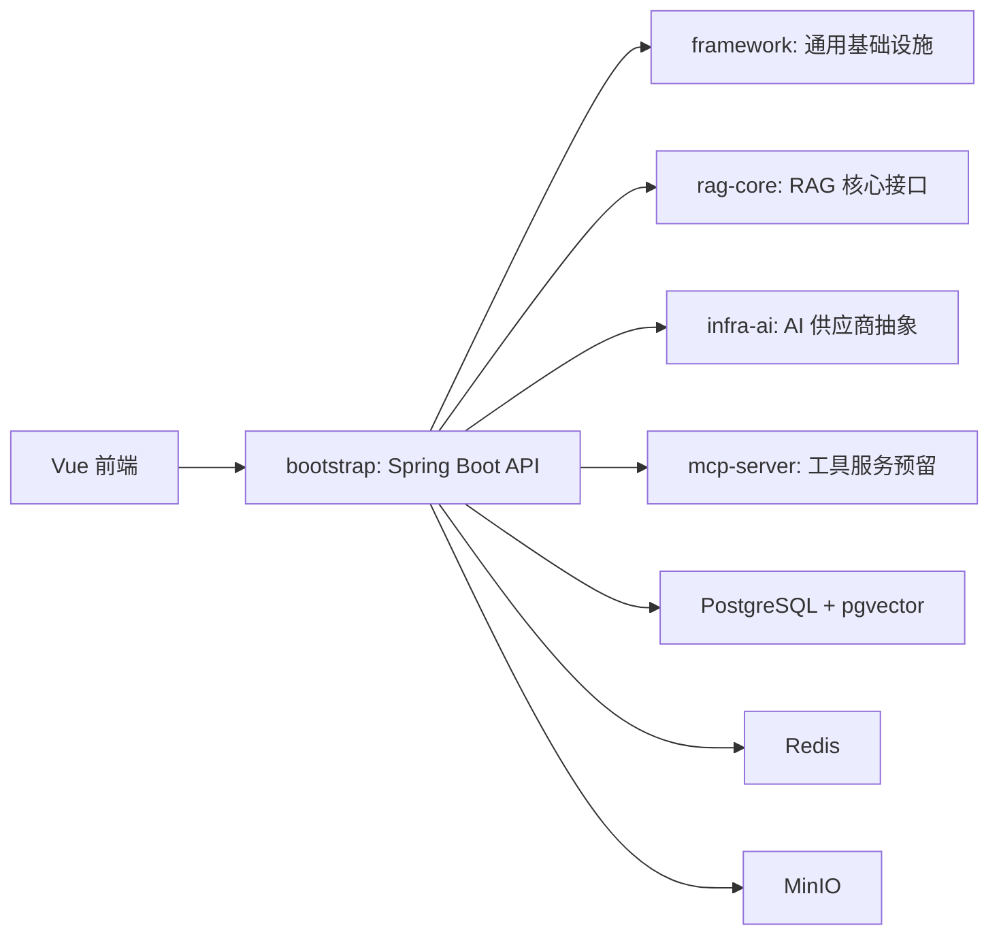

# 架构设计

## 总览

## 模块边界

- `framework` 只放通用工程能力，例如统一响应、异常处理、Redis、鉴权、ORM、限流和 Trace 预留。
- `infra-ai` 只屏蔽 AI 供应商差异，例如 Chat、Embedding、Rerank、VectorStore 接口。
- `rag-core` 只定义 RAG 链路抽象，例如解析、切块、检索、重排和 Prompt 构造。
- `mcp-server` 只作为工具调用服务预留，不在第一阶段实现工具。
- `bootstrap` 负责应用启动、配置装配和对外 API。

## 设计取舍

- 暂不引入 Spring AI 或 LangChain4j 作为核心依赖，避免第一版过早绑定框架抽象。
- 暂不引入 Python 服务，保持 Java 后端主线清晰。
- 向量存储先按 pgvector 预留，后续可通过 `VectorStoreClient` 替换到 Qdrant。
- 第一版只保留受控 Agent 的扩展边界，不做开放式 Agent。

## 生产级能力预留

- 多模型 Provider 路由、熔断和降级。
- 用户级和全局模型调用限流。
- 检索、重排、模型调用和工具调用 Trace。
- 多租户、知识库和文档权限过滤。
- 文档解析与索引构建异步任务。
- 用户反馈与 RAG 评测数据闭环。
