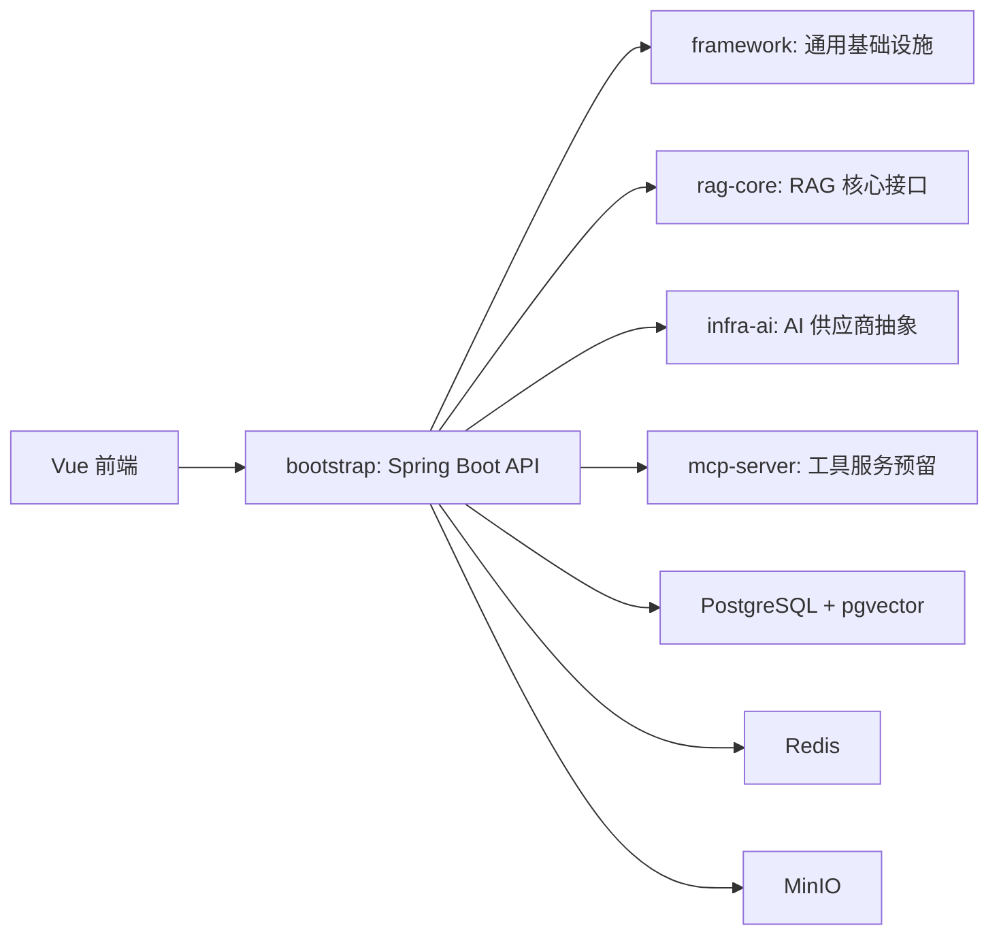

# 技术选型决策（v2）

> 状态：本文档是 RAG2Agent 技术选型阶段的最终决策记录。v1 定稿于 2026-08-06；v2 按企业级六维要求升级：智能体可观测性与流程刚性、存储层高并发/集群/读写分离/向量库/图数据库、检索 Query Routing 与混合检索、模型层大小混用与网关、工具链协议与敏感操作机制、工程底座可观测/缓存/异步。
> 后续实现以此为准；如选型变更，必须同步更新本文档并注明变更原因。
> 版本信息变化快，落地实现时以各组件当时的官方文档和最新稳定版为准。

## 1. 选型原则

- 企业级 = 可维护、可观测、可测试、可扩展、安全、成本可控，而不是"能跑就行"。
- 六维硬性要求必须落到具体组件与机制：智能体流程刚性 + 可观测；存储高并发/集群/读写分离/向量/图；检索路由 + 混合 + 重排；模型大小混用 + 网关；工具协议 + 敏感操作机制；工程可观测 + 缓存 + 异步。
- AI 供应商与向量存储通过接口抽象可替换，核心链路不绑定任何单一框架。
- 模型名、供应商、密钥、路由策略全部配置化，禁止硬编码（DeepSeek 2026-07 已停用旧模型名，这是真实教训）。
- 落地分期：第一版实现可演示闭环，但代码按演进设计写（不写单机专属 hack）；集群、HA、分片作为演进路径明确记录，不欠账、不空谈。

## 2. 全景决策表

| 层次 | 决策 | 备选 | 决策理由 |
|---|---|---|---|
| 前端 | Vue 3 + Vite + TypeScript + Pinia + Vue Router + Element Plus | Naive UI | 国内企业主流、生态全；TS 支撑聊天/流式渲染复杂状态 |
| 后端 | Java 21 + Spring Boot 3.5 + WebMVC + 虚拟线程 + Maven 多模块 | WebFlux | 虚拟线程让阻塞式 AI 调用简单可靠，调试排障成本低 |
| 智能体框架 | 自建持久化执行状态机（AgentRun → Step → ToolCall，状态落库、幂等、人工审批门、轨迹审计） | Temporal / Camunda / LangChain4j | 流程刚性与可观测是 agent 进生产的前提，自建可控可讲 |
| AI 抽象 + 网关 | `infra-ai` 接口 + 自建 model-gateway（路由/限流/熔断/重试/Key 管理/成本计量），OkHttp 直连 OpenAI 兼容 API | Spring AI / LangChain4j | 抽象薄、治理收敛点明确，不绑定快速演进的框架 |
| 模型 | 大小混用：小模型（deepseek-v4-flash）做路由/分类/改写/抽取，大模型（deepseek-v4-pro）做规划/合成/评审；Embedding BGE-M3；Rerank bge-reranker-v2-m3 | Qwen3、OpenAI、本地 vLLM | 中文效果好、成本低、一套 OpenAI 兼容协议通吃 |
| 业务/元数据存储 | PostgreSQL 17 主从（流复制）+ 读写分离（应用层路由，演进 PgBouncer + HAProxy + Patroni） | 单库单机 | 元数据与事务一致性用 PG 最稳，读写分离按演进设计 |
| 向量存储 | pgvector 0.8（第一版主实现，与元数据同库、事务一致）；`VectorStoreClient` 抽象预留 Qdrant / Milvus 集群 | Qdrant 直接上 / Milvus 直接上 | 第一版简单可靠，演进有明确替代路径（判据见 3.2） |
| 图数据库 | Neo4j（GraphRAG：实体/关系抽取、多跳检索、图工具） | 纯文档向量 | 关系型/多跳问题纯向量做不到 |
| 缓存 | 两级：本地 Caffeine（L1）+ Redis 7（L2，Cluster 模式设计，Redisson） | 仅 Redis | 热点与成本敏感场景必须多级缓存 |
| 对象存储 | MinIO（S3 兼容，presigned URL；演进多节点纠删码） | 本地磁盘 | 文档原文留存 + 引用溯源 |
| 消息队列 | RocketMQ 5（入库/Embedding/审计/事件异步；事务消息、延迟、死信） | Kafka | Java 原生、国内主流、事务/延迟/死信齐全 |
| RAG 检索 | Query Routing（规则 + 小模型分类）→ 多路召回（BM25/向量/图）→ RRF 融合 → Rerank → 权限过滤 | 纯向量检索 | 专有名词、编号、关系型问题必须多路解决 |
| 工具链 | MCP 标准协议（官方 Java SDK 1.0.0）+ 内部工具注册表；敏感度分级 + 高风险人工审批 + 审计 + 幂等 | 自研私有协议 | 工具协议标准化 + 安全底线 |
| 流式输出 | SSE（text/event-stream），结构化事件（引用/工具状态/文本增量） | WebSocket | 问答场景 SSE 足够 |
| 工程可观测 | OpenTelemetry + Micrometer/Prometheus + Grafana + JSON 日志（Loki 演进） | 仅日志 | 全链路 trace + 成本指标是企业级标配 |
| 安全 | Sa-Token 鉴权；文档级 ACL 过滤；presigned URL；提示注入防护；Redis 令牌桶限流；工具调用审计 | Spring Security | 国内企业标配、接入成本低 |
| 评测 | 自建评测集 + Hit@k/MRR/Faithfulness + 配置矩阵实验 + CI 冒烟 | RAGAS（Python） | 评测是 RAG 项目核心差异化，Java 主线自建闭环 |
| 部署 | Docker Compose（dev/演示）+ 多阶段镜像；K8s + Helm 演进 | 直接上 K8s | 现阶段避免运维负担，镜像按可部署标准做 |

## 3. 六大企业级能力维度详解

### 3.1 智能体框架：可观测性与流程刚性

决策：自建"持久化执行状态机"Agent Runtime，拒绝把 Agent 写成自由循环。

- 核心模型：AgentRun（一次会话执行）→ Step（规划/检索/工具/生成）→ ToolCall（入参/出参/耗时/Token）；全部落库。
- 状态机显式定义：INIT → ROUTING → EXECUTING → WAITING_APPROVAL → FINALIZING → COMPLETED / FAILED / CANCELLED。
- 流程刚性落地：
  - 状态全落库，应用重启可恢复（从最后状态继续或安全终止）；
  - 最大迭代/工具调用次数硬限制，防失控循环；
  - 每步幂等（工具幂等键），失败重试有上限，超限进 FAILED + 死信；
  - 人工审批是显式状态（WAITING_APPROVAL），审批后放行/拒绝，全审计。
- 可观测性落地：
  - 每步一个 OpenTelemetry Span（route/retrieve/rerank/llm/tool），traceId 贯穿 HTTP → Agent → 模型 → 工具；
  - 执行轨迹（路由决策、检索分数、引用、Token）JSON 落库，作为审计与评测数据源；
  - 指标：步骤耗时、工具成功率、迭代轮数分布、审批等待时长。
- 备选与演进：Temporal（持久化工作流：重试/定时/信号），编排复杂度显著上升后再评估；Camunda 偏向人工流程 BPM，本项目不引入。
- 工程要点：为什么"刚性"是 Agent 进生产的前提；状态机 vs 自由循环；幂等与恢复。

### 3.2 存储层：高并发 / 集群 / 读写分离 / 向量库 / 图数据库

分层决策：

1. 业务元数据（知识库/文档/chunk/任务/评测）：PostgreSQL 17
   - 高可用：主从流复制 + Patroni 自动故障转移（演进）；
   - 读写分离：应用层 `AbstractRoutingDataSource`（写主读从，`@Transactional(readOnly=true)` 路由读），连接池 PgBouncer、入口 HAProxy（演进）；
   - 集群扩展：数据量/并发到瓶颈后评估 Citus 分片（按租户/知识库维度）。
2. 向量检索：pgvector 0.8（第一版主实现）
   - HNSW 索引 + halfvec + binary_quantize + 迭代索引扫描；
   - 演进候选：Qdrant 集群（Raft 元数据一致性 + 分片复制，3 节点起步）与 Milvus 集群（2.6.x / 3.0.x，亿级向量、GPU 索引、原生混合检索）；
   - `VectorStoreClient` 双实现 + 配置路由，接口不变，迁移只改实现与配置。
   - 切换判据：千万级以下、强过滤、轻运维 → Qdrant；亿级向量 / GPU 索引（DiskANN、CAGRA）/ 目标企业技术栈明确使用 Milvus → Milvus；起步阶段要事务一致 → 维持 pgvector。
3. 图数据库：Neo4j
   - 用途：GraphRAG——实体/关系抽取建图、多跳查询（"哪些文档都引用了 X"）、关系召回；同时作为 Agent 的图工具；
   - 落地：第一版 Docker 单实例跑通 GraphRAG 链路（抽取 → 图查询 → 与向量结果融合），集群/因果一致性作为演进。
4. 缓存层：Redis 7（单实例开发，代码按 Cluster 模式设计，Redisson 客户端），演进 3 主 3 从集群。
5. 对象存储：MinIO 单机起步，演进多节点分布式（纠删码、版本控制、生命周期策略）。
6. 消息队列：RocketMQ 5（见 3.6），Broker 单机开发，Producer/Consumer 按集群语义编写。

读写分离与集群是"设计预留 + 演进路径"：第一版代码按多数据源/集群客户端 API 编写，保证演进只改配置不动架构。

工程要点：为什么元数据用 PG 而非全上 NoSQL；读写分离放应用层还是代理层；向量库演进判据（数据量/并发/召回率 vs 运维成本）；图检索解决什么（关系型、多跳问题，纯向量做不到）。

### 3.3 检索策略：Query Routing / 多路召回 / 融合 / 重排

- Query Routing（前置路由）：
  - 规则路由（关键词/正则/黑名单）先拦截确定场景；
  - 小模型分类器（deepseek-v4-flash）对模糊问题做意图/类型分类，输出 routing plan；
  - 路由目标：关键词检索（BM25/tsvector）、语义检索（向量）、图检索（Neo4j）、Agent 工具、直接生成（无检索）。
- 多路召回：BM25（tsvector/pg_trgm）+ 向量（pgvector HNSW）+ 图（Neo4j，可选）并行取 TopK。
- 融合：RRF（Reciprocal Rank Fusion），k 值经评测确定。
- 重排：bge-reranker-v2-m3（cross-encoder）精排 → 权限过滤（先过滤再检索，避免越权数据进上下文）→ 上下文组装（按分数/引用布局）。
- 全链路可观测：每次查询记录路由决策、各路召回分数、融合结果、重排结果、耗时，作为评测与调优数据源。
- 工程要点：为什么需要路由而不是一套检索打天下；RRF 为什么比加权和稳；路由分类为什么用小模型（成本/延迟）。

### 3.4 模型层：大小混用 / LLM 网关 / Embedding

- 大小模型混用（级联策略）：
  - 小模型（deepseek-v4-flash 等便宜模型）：Query 重写、意图/路由分类、实体抽取（建图）、摘要、答案初筛；
  - 大模型（deepseek-v4-pro）：复杂问题规划、长上下文合成、答案评审/校验；
  - 升级机制：置信度阈值 / 任务类型 / 失败降级，全部配置驱动；成本-延迟-质量指标驱动调参。
- LLM 网关（model-gateway，自建模块，基于 infra-ai）：
  - 职责：Provider 路由与负载均衡、限流（用户级/全局）、熔断降级、重试、Key 管理、Token/成本计量、Prompt/响应缓存、审计；
  - 协议：OpenAI 兼容（一套协议覆盖 DeepSeek/Qwen/SiliconFlow/OpenAI）；
  - 演进：可对接 One-API/New API 类网关做计费与 Key 管理（若自建计量不够），核心路由逻辑保留在自建网关；
  - 工程要点：网关是 AI 应用的企业级标配（成本与治理的收敛点）；自建 vs 开源网关的取舍。
- Embedding：BGE-M3（稠密+稀疏一体）；Query 侧可先小模型改写再 embedding；结果按文本 hash + 模型维度进 Redis 缓存；Rerank 用 bge-reranker-v2-m3。
- 演进：私有化推理 vLLM（OpenAI 兼容 API），第一版不引入本地 GPU 依赖。

### 3.5 工具链：工具协议 / 敏感操作机制

- 工具协议：MCP 为标准（官方 Java SDK `io.modelcontextprotocol.sdk:mcp` 1.0.0），内部工具与外部 MCP 工具统一进工具注册表。
  - 统一 ToolDescriptor：名称/描述/参数 JSON Schema/敏感度/授权角色/超时/重试/幂等键/成本等级；
  - 接入通道：内部 Java 工具（注册表注册）+ 外部 MCP 工具（stdio / Streamable HTTP）。
- 敏感操作机制：
  - 敏感度分级：只读（查询/检索）→ 普通写（知识库内操作）→ 高风险（跨系统、外部副作用、删除、支付类）；
  - 高风险操作必须 human-in-the-loop 审批（Agent 进入 WAITING_APPROVAL），审批动作全审计；
  - 工具入参按 JSON Schema 严格校验；出参过脱敏/过滤（敏感数据、PII）；
  - 工具幂等设计（幂等键落库），防止重试副作用；
  - 按角色/租户授权工具可见性；工具调用计入限流与成本。
- 工程要点：MCP 解决了什么（工具协议标准化）；敏感度分级与审批是 Agent 落地的安全底线。

### 3.6 工程底座：可观测性 / 缓存 / 异步

- 可观测性：
  - Trace：OpenTelemetry Java agent + OTLP，HTTP → 路由 → 检索 → 重排 → 模型 → 工具 → 异步任务全链路；
  - Metrics：Micrometer（QPS、P99 延迟、Token 成本、错误率、缓存命中率、队列积压/消费延迟）→ Prometheus + Grafana；
  - Logs：JSON 结构化 + traceId/spanId + 业务维度（userId/知识库/模型）；集中收集 Loki（演进）；
  - 告警：延迟/成本/错误率阈值告警（演进）。
- 缓存层（多级）：
  - L1 本地 Caffeine：热点检索结果/配置/路由表，短 TTL；
  - L2 Redis：embedding 向量、检索结果（同 query 短 TTL）、会话记忆、限流计数、分布式锁；
  - 一致性：版本号/失效策略；写路径先失效再回源；缓存命中率纳入指标。
- 异步处理：
  - RocketMQ 5 承载：文档解析/切块/Embedding 批量任务、索引构建、审计日志异步落库、Agent 事件；
  - 可靠性：任务状态机 + 消息重试 + 死信队列 + 消费幂等（消息去重键）；延迟消息用于重试退避；
  - 队列指标：积压数、消费延迟、死信数纳入监控。
- 工程要点：AI 场景缓存命中率直接等于成本；异步任务的可观测闭环（状态机 + 消息 + 指标三件套）。

## 4. 其他层决策

### 4.1 前端

- Vue 3 + Vite（已定），补 TypeScript；Pinia + Vue Router + Element Plus。
- 关键页面：对话页（SSE 流式渲染 + 引用卡片 + 工具调用状态 + 审批弹窗）、知识库管理（上传/解析/索引状态）、评测实验页。
- 流式：聊天是 POST，用 `fetch` + `ReadableStream` 解析 SSE（`EventSource` 只支持 GET）。
- 工程要点：流式增量渲染状态管理；引用与审批状态的前端呈现。

### 4.2 后端与并发

- WebMVC + 虚拟线程（`spring.threads.virtual.enabled=true`）；OkHttp 连接池 + 独立 connect/read/write 超时；Resilience4j 在 client 外层做重试/熔断/降级。
- 多数据源：`AbstractRoutingDataSource` 读写分离 + 事务边界规范（写操作走主库、`@Transactional(readOnly=true)` 走从库）。
- 工程要点：虚拟线程 vs WebFlux；读写分离的事务边界坑（读从库读到旧数据）。

### 4.3 文档入库 Pipeline

- 解析：Apache PDFBox 3（文本层）+ Tabula（表格）；扫描件 OCR（Qwen-VL 视觉模型）作为后续增强。
- 切块：递归字符 + 标题感知 + overlap + 父子块，参数配置化。
- Embedding：批量、幂等（文档版本号 + chunk hash）、失败重试。
- 任务状态机：PENDING → PARSING → SPLITTING → EMBEDDING → INDEXED / FAILED，经 RocketMQ 触发，延迟消息重试，死信记录。
- 工程要点：解析质量决定 RAG 上限；切块策略必须用评测数据决策。

### 4.4 生成与引用溯源

- 检索结果强制带引用（chunk → document + 页码 + MinIO 原文快照），无引用不答；SSE 流式返回。

### 4.5 安全

- Sa-Token 鉴权；文档级 ACL 在检索 SQL 层过滤；MinIO presigned URL；提示注入防护（系统提示隔离、工具白名单、输出过滤）；令牌桶限流；全量审计。

### 4.6 部署

- 开发/演示：Docker Compose；应用镜像：多阶段 Dockerfile（Maven 构建 → JRE 21 运行时），非 root 运行；配置环境变量驱动，密钥不进仓库；K8s + Helm 演进。
- 配置与密钥分离的完整说明与演进路径见第 10 节。

## 5. 明确不选

- Spring AI / LangChain4j 作为核心：版本分裂（Spring AI 2.0 基于 Boot 4，Boot 3.5 对应 1.1.x）、抽象厚、定制受限；仅作参考与备选 Provider。
- Temporal / Camunda：第一版自建状态机足够；编排复杂度显著上升后再评估 Temporal。
- Elasticsearch / OpenSearch：tsvector + pg_trgm 起步；中文分词或规模成为瓶颈后再评估。
- WebFlux：虚拟线程已解决阻塞 IO 并发。
- gRPC：内部 REST + MCP 足够。
- Kafka：第一版用 RocketMQ（Java 原生、事务/延迟/死信齐全、国内主流）；若后续需要更强流处理生态再评估。
- 开放式自主多 Agent：不可控，安全与成本风险高。
- 自研私有工具协议：统一走 MCP。

## 6. 生态现状快照（2026-08，落地时复核）

- Spring Boot 3.5.7（pom 已定）；Spring AI 2.0 已 GA 但基于 Boot 4 / Spring Framework 7，Boot 3.5 对应 Spring AI 1.1.x 稳定线。
- pgvector 0.8.x：halfvec、sparsevec、binary_quantize、迭代索引扫描、HNSW 构建提速。
- MCP Java SDK 1.0.0 GA（2026-02，官方维护，与 Spring AI 协作）。
- DeepSeek：`deepseek-chat` / `deepseek-reasoner` 已于 2026-07-24 停用，新模型名以 `deepseek-v4-flash` / `deepseek-v4-pro` 为代表。
- SiliconFlow：`BAAI/bge-m3`（embedding）、`BAAI/bge-reranker-v2-m3`（rerank）API 可用。
- Qdrant 分布式：Raft 元数据一致性 + 数据分片复制，最小可用集群 3 节点。
- Milvus 2.6.x / 3.0.x：原生混合检索（Sparse-BM25）、GPU 索引（HNSW / DiskANN / CAGRA）、亿级向量；Java SDK 3.x。
- RocketMQ 5.x：事务消息、延迟/定时消息、死信队列，Java 5.x SDK。
- Neo4j：官方 GraphRAG 支持（2026 版本），Cypher 多跳检索。
- PostgreSQL HA 主流组合：Patroni（故障转移）+ PgBouncer（连接池）+ HAProxy（入口/负载均衡）。
- Redisson：Redis Cluster 客户端标准；Caffeine：JVM 本地缓存标准。

## 7. 落地分期

### 第一期（可演示闭环，代码按演进设计写）

- 单体部署：PostgreSQL 单主（读写分离代码预留）+ pgvector + Redis + MinIO + RocketMQ 单 Broker + Neo4j 单实例。
- Agent 持久化状态机 + 人工审批 + 轨迹落库。
- Query Routing（规则 + 小模型分类）+ 混合检索 + RRF + Rerank + GraphRAG 图召回。
- 模型级联（flash/pro）+ 自建网关基础版 + BGE-M3 / bge-reranker API。
- 两级缓存（Caffeine + Redis）+ OpenTelemetry + Prometheus + JSON 日志 + RocketMQ 异步入库。
- 评测集 + 配置矩阵实验 + CI 冒烟评测。

### 演进（设计预留，不在第一版引入）

- Patroni + PgBouncer + HAProxy（读写分离与 HA）；Citus 分片。
- Redis Cluster 3 主 3 从；MinIO 多节点分布式（纠删码）。
- Qdrant 集群（3 节点）或 Milvus 集群（按 3.2 判据选择）；Neo4j 集群。
- Temporal（复杂编排需求出现时）；One-API（外部计费/Key 管理）；vLLM（私有化推理）。
- K8s + Helm。

### 分阶段落地顺序（Phase 1-6）

> 与"第一期 / 演进"互为补充：Phase 按能力域切分，体现从骨架到生产级的演进节奏；第一期按"可演示闭环"划定首期边界。以本节为准，避免两处口径漂移。

- Phase 1 基础工程框架：Maven 多模块、Spring Boot 启动、Docker Compose 中间件、AI 与 RAG 核心接口、最小 Vue 前端、健康检查/版本信息/Provider 占位。
- Phase 2 企业业务底座：用户/组织/角色权限、知识库与文档元数据、审计日志、MinIO 上传链路。
- Phase 3 RAG 文档入库：解析 Pipeline、清洗切块、Embedding + pgvector 写入、任务状态与失败重试。
- Phase 4 问答与引用溯源：混合检索、Rerank、Prompt 构造、SSE 流式回答、引用来源与权限过滤。
- Phase 5 受控 Agent：意图识别、RAG 与工具调用路由、MCP 工具接入、运行轨迹与人工确认。
- Phase 6 生产级增强：模型路由/熔断/降级、限流与成本统计、OpenTelemetry Trace、RAG 评测集与反馈闭环。

## 8. 技术亮点与决策主线

1. 为什么 Java 不用 Python：就业主线 + AI 能力基础设施化。
2. 智能体流程刚性：状态机 + 幂等 + 审批门 + 轨迹审计，而不是自由循环。
3. 自建 AI 抽象与 LLM 网关：为什么不用 Spring AI；网关收敛治理与成本。
4. Query Routing + 混合检索 + RRF + 重排：每一条都是可解释的工程决策。
5. 存储分层与演进：读写分离、向量库、图库各解决什么问题，演进判据是什么。
6. 大小模型混用与成本指标：小模型分流、升级机制、成本-延迟-质量三角。
7. 工具链：MCP 协议 + 敏感操作审批。
8. 工程底座：可观测、多级缓存、异步任务闭环。
9. RAG 评测：没有评测不谈优化。

## 9. 模块边界与架构取舍

### 9.1 模块总览

### 9.2 模块边界

- `framework` 只放通用工程能力：统一响应、异常处理、Redis、鉴权、ORM、限流和 Trace 预留。
- `infra-ai` 只屏蔽 AI 供应商差异：Chat、Embedding、Rerank、VectorStore 接口。
- `rag-core` 只定义 RAG 链路抽象：解析、切块、检索、重排和 Prompt 构造。
- `mcp-server` 只作为工具调用服务预留，第一阶段不实现工具。
- `bootstrap` 负责应用启动、配置装配和对外 API，是唯一对外入口。

### 9.3 设计取舍（与第 5 节互补）

- 暂不引入 Python 服务，保持 Java 后端主线清晰（就业主线 + AI 能力基础设施化）。
- 其余取舍（不引入 Spring AI / LangChain4j、pgvector 预留 Qdrant、只留受控 Agent 扩展边界）见第 5 节"明确不选"及 3.1 / 3.2。

### 9.4 生产级能力预留（对应第 3 节各维度）

- 多模型 Provider 路由、熔断和降级；用户级和全局模型调用限流；检索、重排、模型调用和工具调用 Trace；多租户、知识库和文档权限过滤；文档解析与索引构建异步任务；用户反馈与 RAG 评测数据闭环。落地时序见第 7 节 Phase 1-6。

## 10. 配置与密钥管理

> 核心原则：**配置与密钥分离**。配置（地址、模型名、开关）可以进仓库；密钥（API Key、密码）永远不进仓库。

### 10.1 为什么用 .env

- 本地开发需要真实的 API Key 和数据库口令，但项目是公开仓库，密钥提交即泄露。
- `.env` 位于项目根目录，被 `.gitignore` 忽略，只存在于本地，不进入任何提交、镜像或制品。
- 应用启动时由自写的 `DotenvEnvironmentPostProcessor` 加载（自动向上查找 `.env`）：
  - **系统环境变量优先**（生产/容器直接注入），`.env` 只补缺（本地开发）；
  - 不引入 spring-dotenv 的原因：该库停留在 2023 年的 4.0.0，与 Spring Boot 3.5 不兼容，实测未加载 `.env`，自写实现 20 行可控。
- 代码中所有敏感值通过 `${VAR:默认值}` 占位符注入，零硬编码。
- 对外接口不返回密钥：`/api/ai/providers` 仅暴露名称、地址、能力，不含 apiKey。

### 10.2 当前密钥清单（仅本地 .env）

- DeepSeek：`DEEPSEEK_API_KEY`、`DEEPSEEK_MODEL`、`DEEPSEEK_MODEL_PRO`
- 硅基流动：`SILICONFLOW_API_KEY`、`SILICONFLOW_EMBEDDING_MODEL`、`SILICONFLOW_RERANK_MODEL`
- 本地中间件默认口令：PostgreSQL / MinIO / Neo4j（仅开发环境默认值）

### 10.3 未来企业级密钥管理（演进路径）

#### 阶段 1（当前）：.env + 环境变量

本地开发兜底方案，密钥只存在于开发机，不进入仓库与制品。

#### 阶段 2：容器 / 部署环境注入

- Docker Compose：`environment` 引用宿主环境变量，或使用 Docker Secrets（Swarm 模式）；
- Kubernetes：`Secret` 对象挂载为环境变量或文件，Deployment 引用，镜像内不烧录密钥；
- 原则：密钥在启动时注入，运行环境不落盘明文。

#### 阶段 3：专用密钥管理服务（生产标准）

- 云厂商托管：AWS Secrets Manager、阿里云 KMS、腾讯云凭据管理系统；
- 自建开源：HashiCorp Vault（动态密钥、租约、轮换、审计）；
- 接入方式：应用启动时通过 SDK 拉取密钥并注入 Spring Environment（如 Spring Cloud Config + Vault 集成），运行时本地不持有明文密钥；
- 配套机制：密钥定期轮换、最小权限（每服务独立密钥）、访问审计、异常告警。

### 10.4 落地检查清单

- [ ] git 中不存在任何真实密钥（含 git log 历史）
- [ ] 配置文件只有 `${VAR:默认值}` 占位符，无硬编码
- [ ] 对外接口不返回密钥
- [ ] 生产环境密钥从密钥管理服务注入，本地不分发明文
